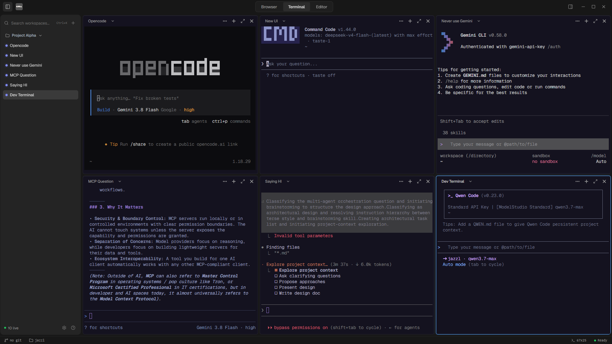

<h1 align="center">Oppa ⚡</h1>

<p align="center">
  <a href="https://github.com/dreamydani/oppa/releases/latest"></a>
  
  
</p>

<p align="center">
  <strong>A fast, low-memory terminal that never loses your shell.</strong><br />
  Detached daemon sessions, instant reattachment, and zero-drop flow control.
</p>

<h3 align="center"><a href="https://github.com/dreamydani/oppa/releases/latest"><ins>Download Oppa</ins></a></h3>

<p align="center">
  
</p>

## Why Oppa

- **Sessions survive restarts.** Shells and long-running jobs live in a detached Rust daemon, not in the window. Close the GUI and everything keeps running.
- **Reopening is instant.** Each session keeps an in-memory screen mirror, so reattachment restores full text, formatting, and cursor state without restarting the shell.
- **Massive output stays bounded.** ACK-based backpressure pauses the reader under load instead of buffering unboundedly — and never drops a byte.

## Features

- Detached background daemon with persistent PTY sessions across GUI restarts.
- Warm reattachment with VT100 screen mirroring for instant UI hydration.
- Split panes, tabs, and workspace layouts for multi-project work.
- Browser viewport for local development servers and documentation.
- Editor pane with syntax highlighting, Markdown preview, and diff inspection.
- ACK-based flow control (pause above 256 KB, resume below 32 KB).

## How it works

Oppa ships as one binary with two roles:

```
            ┌──────────────────────────────┐
            │          Oppa GUI            │
            │  (Tauri 2 + React 19 UI)     │
            └──────────────┬───────────────┘
                           │  named pipe / Unix socket
                           │  newline-delimited JSON-RPC
                           ▼
            ┌──────────────────────────────┐
            │     Oppa Daemon (--daemon)   │
            │  Session registry (PTYs)     │
            │  ScreenMirror (vt100 state)  │
            │  Flow control / ACKs         │
            └──────────────────────────────┘
```

- On launch the GUI connects to the daemon, spawning one in the background when absent.
- `CreateOrAttach` returns `is_new: false` plus an ANSI snapshot for existing sessions; the frontend paints the snapshot into xterm and live streaming resumes.
- Closing the window disconnects; closing a pane sends `Kill`, which terminates the process group and frees the session.
- See `docs/ARCHITECTURE.md` for the full design.

## Install

Download the installer for your platform from [GitHub Releases](https://github.com/dreamydani/oppa/releases/latest).

To run from source:

```bash
pnpm install
pnpm tauri dev
```

Web-only UI preview (no PTY backend):

```bash
pnpm dev
```

Prerequisites: Node.js 18+ (20+ recommended) with `pnpm`, and Rust 1.77+ via `rustup`.

## Developing

```bash
pnpm tauri dev        # desktop app
pnpm vitest run       # renderer tests
cargo test -p oppa --lib  # Rust unit tests (run in src-tauri)
```

Want to contribute? See [CONTRIBUTING.md](CONTRIBUTING.md) for setup, conventions, and the pre-PR checklist.

## Community & Support

- Issues and feature requests: [github.com/dreamydani/oppa/issues](https://github.com/dreamydani/oppa/issues)

## License

Oppa is free and open source under the [MIT License](LICENSE). Third-party attributions are listed in [THIRD-PARTY-NOTICES.md](THIRD-PARTY-NOTICES.md).
