# OPPA — Continuous Live Persistence & Orca Parity Design

Date: 2026-08-17
Status: Approved

## Purpose

Eliminate reliance on graceful GUI window close events by introducing **continuous live background auto-persistence** in OPPA (`D:\oppa\oppa`). Even if the process is terminated abruptly via CLI `Ctrl+C`, task manager kill, or sudden power loss, all tabs, split pane trees, working directories, and terminal scrollback histories will be 100% restored on next launch, matching Orca's resilience.

---

## Architecture & Live Persistence Pipeline

```mermaid
flowchart TD
    subgraph LIVE_EVENTS [Live Terminal Events]
        OUTPUT[PTY Data Ingest] --> PARSED[onWriteParsed / Idle 500ms]
        PARSED --> DEBOUNCE_SNAP[Debounced saveScrollback to Disk]
        
        TAB_ACTION[createTab / splitPane / closePane / selectTab] --> INSTANT_SAVE[Instant saveLayout to layout.json]
    end

    subgraph CRASH_OR_KILL [Any Termination Event]
        KILL[Ctrl+C in CLI / Alt+F4 / Crash / X Button] --> DISK[(Disk is ALREADY Up-To-Date)]
    end

    subgraph RESTORE [Next Startup]
        START[pnpm tauri dev / App Launch] --> READ_LAYOUT[Read layout.json]
        READ_LAYOUT --> SPAWN_TABS[Recreate All Tabs & Splits]
        SPAWN_TABS --> REPLAY[Replay Saved Scrollbacks]
        REPLAY --> BANNER[Render Session Restored Divider]
        BANNER --> FRESH_SHELL[Start Shell at Preserved CWD]
    end
```



---

## Technical Specifications

### 1. Continuous Live Scrollback Sync (`TerminalPane.tsx`)
- In `TerminalPane.tsx`:
  - When PTY data arrives, debounce a 500ms idle snapshot flush.
  - When the debounced timer fires:
    ```typescript
    const buffer = serializeAddonRef.current?.serialize();
    if (buffer) {
      useTerminalStore.getState().cacheScrollback(idRef.current, buffer);
      void saveScrollback(idRef.current, buffer).catch(() => {});
    }
    ```
  - On component unmount (e.g. switching tabs), flush immediately without debounce.

### 2. Immediate Layout Sync on All Actions (`terminalStore.ts`)
- `createTab`, `closeTab`, `selectTab`, `renameTab`, `splitPane`, `closePane`, `setRatio`, `updateSessionCwd`:
  - Each action immediately triggers `void get().saveLayout().catch(() => {})`.
  - `saveLayout()` writes the updated tab tree to `layout.json` and flushes all active & cached scrollbacks to `<app_data_dir>/terminal-scrollback/<id>.bin`.

### 3. Startup Hydration & Restore (`terminalStore.ts` & `TerminalPane.tsx`)
- On startup, `loadLayout()`:
  - Reads `layout.json`.
  - Spawns fresh shell sessions for each tab and split leaf in their preserved working directories.
  - Loads `<app_data_dir>/terminal-scrollback/<old_id>.bin`.
  - Sets `restoredScrollbacks[new_id] = previousScrollback`.
  - Migrates snapshot to `new_id`.
  - Marks `ready: true`.
- When `TerminalPane` mounts:
  - Writes `restoredScrollback` to `term.write(...)`.
  - Inserts `\r\n\x1b[2m── [Session Restored] ──────────────────────────────────────\x1b[0m\r\n`.
  - Connects live PTY streams.

---

## Testing & Verification Plan

### Frontend Tests (`pnpm vitest run`):
1. Test that `createTab`, `splitPane`, `closePane`, `updateSessionCwd` all call `saveLayout`.
2. Test that `saveLayout` saves both active and cached scrollbacks to disk.
3. Test that `TerminalPane` unmount and output trigger buffer serialization.
4. Test that `loadLayout` restores multi-tab hierarchies and scrollbacks cleanly.

### Build Verification:
- `pnpm vitest run` (100% tests passing).
- `pnpm build`.
- `cargo test -p oppa --lib`.
- `cargo check`.
