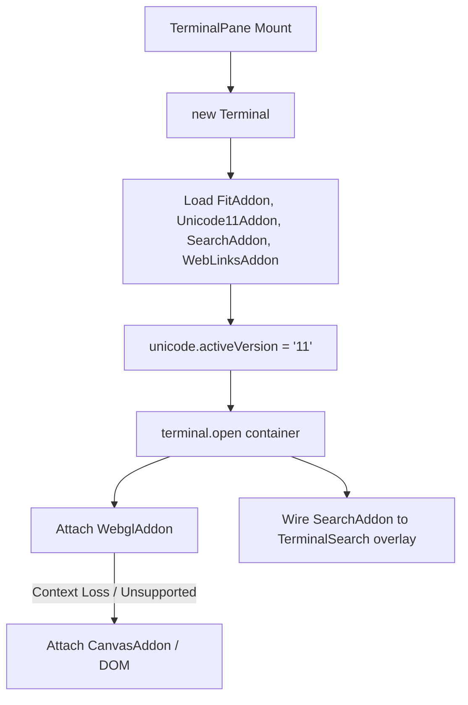

# OPPA — Rich xterm.js Addons & WebGL Performance Design

Date: 2026-08-17
Status: Approved

## Purpose

Upgrade the frontend terminal rendering engine of OPPA (`D:\oppa\oppa`) to match modern high-performance desktop terminals (like Orca and VS Code).

Specifically, this milestone delivers:
1. **GPU Acceleration & Resilient Rendering**: Integrates `@xterm/addon-webgl` for 60fps rendering with automatic fallback to `@xterm/addon-canvas` or DOM renderer on WebGL context loss or unsupported environments.
2. **Accurate Unicode 11 Width Calculation**: Integrates `@xterm/addon-unicode11` and sets active version to `11`, preventing wide Asian (CJK) characters, emojis, and ZWJ sequences from overlapping or clipping.
3. **Interactive Link Detection**: Integrates `@xterm/addon-web-links` with Tauri opener integration (`@tauri-apps/plugin-opener`) to allow clicking URLs in the terminal.
4. **Interactive In-Pane Search Bar**: Integrates `@xterm/addon-search` and builds a floating search overlay component (`TerminalSearch.tsx`) with `Ctrl+F` / `Cmd+F` shortcuts, supporting Next (`Enter`), Previous (`Shift+Enter`), Case Sensitivity, Regex, and Close (`Esc`).

---

## Architecture & Addon Pipeline

All frontend terminal addon loading and search overlay state live in `src/components/` and `src/lib/`.

```
src/
├── components/
│   ├── TerminalPane.tsx       # Main pane component with WebGL, Unicode11, WebLinks, Search addons
│   ├── TerminalSearch.tsx     # Floating search bar overlay component
│   └── TerminalSearch.test.tsx # Search UI & keybinding unit tests
```



---

## Technical Specifications

### 1. NPM Dependencies
```json
{
  "dependencies": {
    "@xterm/addon-canvas": "^0.8.0",
    "@xterm/addon-search": "^0.16.0",
    "@xterm/addon-unicode11": "^0.9.0",
    "@xterm/addon-web-links": "^0.11.0"
  }
}
```

### 2. Renderer Lifecycle & Addon Management (`TerminalPane.tsx`)
1. **Instantiation**:
   - `FitAddon`: Fitted on resize.
   - `Unicode11Addon`: Loaded and activated via `term.unicode.activeVersion = '11'`.
   - `SearchAddon`: Loaded and passed to the search overlay.
   - `WebLinksAddon`: Loaded with click handler delegating to `openUrl(url)`.
2. **WebGL Addon with Fallback**:
   - `term.open(containerRef.current!)` is called first.
   - Try creating and loading `new WebglAddon()`.
   - Attach `webglAddon.onContextLoss(() => { webglAddon.dispose(); loadCanvasOrDomFallback(term); })`.
   - Catch initialization errors (e.g. headless / test / VM environments) and degrade gracefully.

### 3. Floating Search Overlay (`TerminalSearch.tsx`)
- **State & Props**:
  ```typescript
  interface TerminalSearchProps {
    searchAddon: SearchAddon;
    onClose: () => void;
  }
  ```
- **UI Elements**:
  - Input field with auto-focus on mount.
  - Action buttons: Previous (`▲`), Next (`▼`), Case Sensitivity (`Aa`), Regex (`.*`), Close (`✕`).
- **Keyboard Shortcuts**:
  - `Enter`: Find next match.
  - `Shift+Enter`: Find previous match.
  - `Esc`: Close search and return focus to terminal.
  - `Ctrl+F` / `Cmd+F`: Toggles search open on the active `TerminalPane`.

---

## Testing & Verification Plan

### Frontend Tests (`pnpm vitest run`):
1. `TerminalSearch.test.tsx`:
   - Verify search bar opens, binds search queries, calls `findNext` / `findPrevious`.
   - Verify `Enter`, `Shift+Enter`, and `Esc` key handling.
   - Verify toggling regex and case sensitivity modes.
2. `TerminalPane.test.tsx`:
   - Verify `Unicode11Addon` is registered and active.
   - Verify `WebLinksAddon` and `SearchAddon` are loaded.
   - Verify `Ctrl+F` shortcut opens search overlay.
   - Verify WebGL context-loss fallback behavior.

### Full Build Verification:
- `pnpm build` (clean TypeScript compilation + Vite bundle).
- `cargo check` in `src-tauri`.
