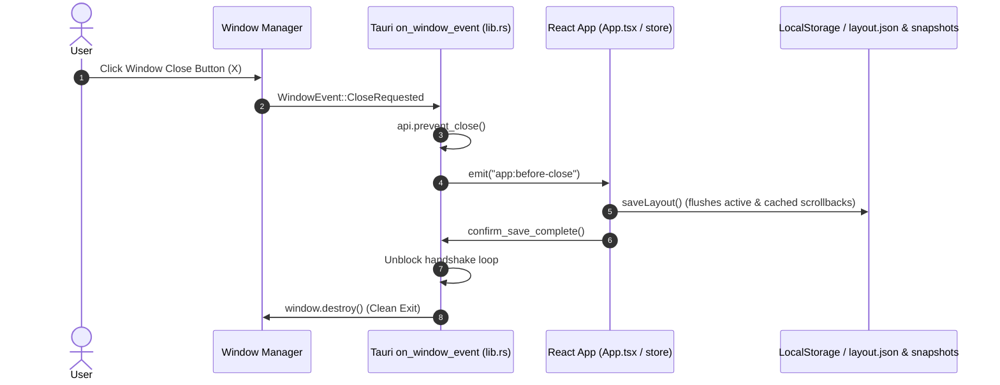

# OPPA — Robust Terminal Restore & Window Close Handshake Design

Date: 2026-08-17
Status: Approved

## Purpose

Fix window close save interception and multi-tab scrollback retention in OPPA (`D:\oppa\oppa`) to achieve full architectural parity with Orca's terminal shutdown and cold restore pipeline.

Specifically, this milestone delivers:
1. **Tauri 2 `WindowEvent::CloseRequested` Interception**: Intercepts window close before webview destruction in Rust, prevents premature window tear-down, triggers `app:before-close` to the live webview, awaits `confirm_save_complete` with timeout fallback, and then destroys the window.
2. **Multi-Tab Scrollback Cache**: Caches serialized ANSI buffers on pane unmount / tab switch in `terminalStore.ts`, ensuring background tabs always preserve their scrollbacks when `saveLayout()` runs.
3. **Debounced Auto-Save**: Automatically flushes layout and scrollback snapshots on layout modifications (tab creation, split, tab switch) to guarantee disk snapshots are continuously up to date.
4. **Resilient Cold Restore**: Ensures all tabs, split hierarchies, working directories, and scrollback histories (with `[Session Restored]` dividers) cleanly reload upon launching `pnpm tauri dev` or running the desktop app.

---

## Architecture & Lifecycle



---

## Technical Specifications

### 1. Rust Window Close Handshake (`src-tauri/src/lib.rs`)

```rust
tauri::Builder::default()
    .on_window_event(move |window, event| {
        if let tauri::WindowEvent::CloseRequested { api, .. } = event {
            api.prevent_close();
            let window_clone = window.clone();
            let flag = window.state::<Arc<AtomicBool>>();
            flag.store(false, Ordering::SeqCst);

            tauri::async_runtime::spawn(async move {
                let _ = window_clone.emit("app:before-close", ());
                let deadline = Instant::now() + Duration::from_millis(1500);
                while Instant::now() < deadline {
                    if flag.load(Ordering::SeqCst) {
                        break;
                    }
                    tokio::time::sleep(Duration::from_millis(25)).await;
                }
                let _ = window_clone.destroy();
            });
        }
    })
```

### 2. Multi-Tab Scrollback Cache & Auto-Save (`terminalStore.ts` & `TerminalPane.tsx`)

1. **State Addition in `terminalStore.ts`**:
   - `cachedScrollbacks: Record<string, string>`
   - `cacheScrollback: (id: string, buffer: string) => void`
2. **Pane Cleanup in `TerminalPane.tsx`**:
   - Inside `useEffect` cleanup return:
     ```typescript
     const buffer = serializeAddonRef.current?.serialize();
     if (buffer) {
       useTerminalStore.getState().cacheScrollback(idRef.current, buffer);
     }
     ```
3. **Comprehensive Saving in `saveLayout()`**:
   - For every session in `sessions`:
     - If `serializers[s.id]` exists (active pane), call `serializers[s.id]()`.
     - Otherwise fallback to `cachedScrollbacks[s.id]`.
     - Save buffer via `saveScrollback(s.id, buffer)`.

---

## Testing & Verification Plan

### Frontend Unit Tests (`pnpm vitest run`):
1. `terminalStore.test.ts`:
   - Test that `cacheScrollback` stores buffer.
   - Test that `saveLayout` writes scrollback for sessions that only exist in `cachedScrollbacks` (simulating background tabs).
   - Test that switching tabs preserves scrollback in `cachedScrollbacks`.
2. `App.test.tsx`:
   - Test `app:before-close` event handler calls `saveLayout` and `confirmSaveComplete`.

### Rust Backend Tests:
- `cargo test -p oppa --lib`
- `cargo check` in `src-tauri`
