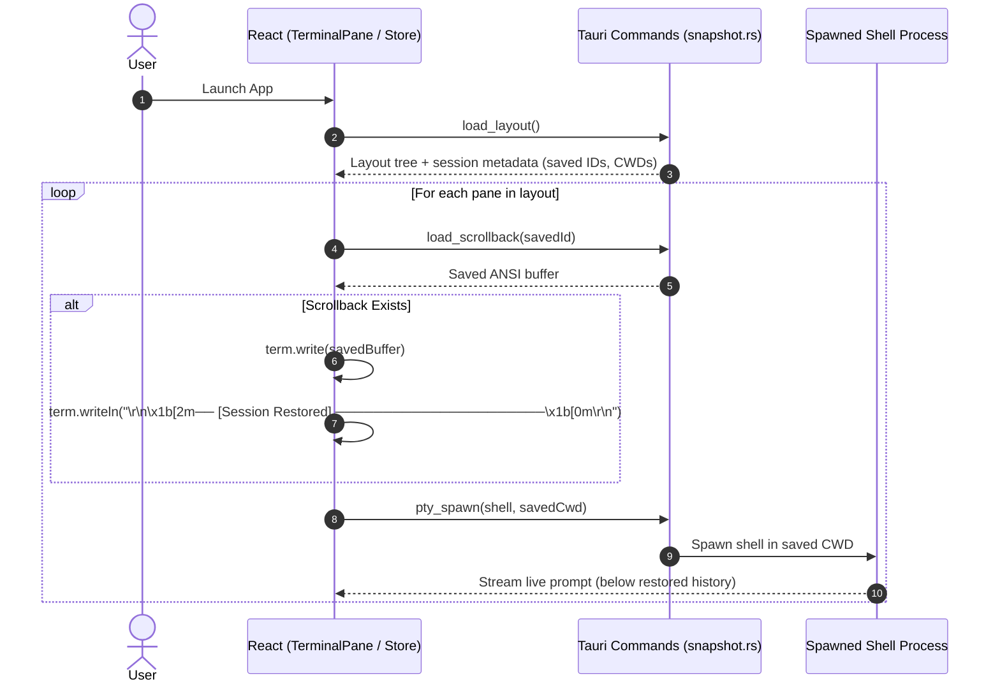

# OPPA — Scrollback Snapshots & Cold Restore Design

Date: 2026-08-17
Status: Approved

## Purpose

Implement persistent scrollback recovery and cold restore in OPPA (`D:\oppa\oppa`). When the user closes and re-opens the app, previous terminal outputs, logs, and command histories are preserved and restored into the layout panes, separated from the new live shell session by a clean visual indicator.

Specifically, this milestone delivers:
1. **Frontend Buffer Serialization**: Integrates `@xterm/addon-serialize` to capture the active and scrollback ANSI buffers of each terminal pane.
2. **Atomic Disk Snapshots in Rust Backend**: Implements atomic file persistence (`snapshot.rs`) writing snapshots to `<app_data_dir>/terminal-scrollback/<id>.bin` using temporary file rename patterns to prevent corruption on crash or abrupt exit.
3. **Cold Restore Lifecycle**: On app launch, `loadLayout()` loads both the pane geometry and corresponding scrollback snapshots, replays previous output into xterm, renders a dimmed `── [Session Restored] ──` divider, and starts a fresh interactive shell in the preserved working directory.
4. **Garbage Collection**: Prunes stale scrollback files on disk when panes are closed or layouts are pruned.

---

## Architecture & Lifecycle



---

## Technical Specifications

### 1. NPM Dependencies
```json
{
  "dependencies": {
    "@xterm/addon-serialize": "^0.13.0"
  }
}
```

### 2. Rust Backend Snapshot Storage (`src-tauri/src/pty/snapshot.rs`)

Snapshots are stored in `<app_data_dir>/terminal-scrollback/<id>.bin`.

```rust
pub struct SnapshotStorage {
    dir: PathBuf,
}

impl SnapshotStorage {
    pub fn new(app_data_dir: PathBuf) -> Self;
    pub fn save(&self, id: &str, data: &str) -> std::io::Result<()>;
    pub fn load(&self, id: &str) -> std::io::Result<Option<String>>;
    pub fn delete(&self, id: &str) -> std::io::Result<()>;
    pub fn cleanup_stale(&self, active_ids: &[String]) -> std::io::Result<()>;
}
```

#### Atomic Write Pattern:
1. Ensure `<app_data_dir>/terminal-scrollback/` directory exists.
2. Trim data to trailing 500KB at a valid UTF-8 boundary.
3. Write to `<app_data_dir>/terminal-scrollback/<id>.tmp.<uuid>`.
4. Rename `tmp` file to `<id>.bin`.

### 3. Tauri Commands (`src-tauri/src/pty/commands.rs` & `layout.rs`)
- `save_scrollback(app: AppHandle, id: String, data: String) -> Result<(), String>`
- `load_scrollback(app: AppHandle, id: String) -> Result<Option<String>, String>`
- `delete_scrollback(app: AppHandle, id: String) -> Result<(), String>`
- `cleanup_stale_scrollbacks(app: AppHandle, active_ids: Vec<String>) -> Result<(), String>`

### 4. Frontend Integration (`src/lib/pty/transport.ts` & `src/store/terminalStore.ts`)
- **Transport**:
  - `saveScrollback(id: string, data: string): Promise<void>`
  - `loadScrollback(id: string): Promise<string | null>`
  - `deleteScrollback(id: string): Promise<void>`
- **Store & TerminalPane**:
  - `serializeAddon` attached on mount.
  - `saveLayout()` serializes each running pane's buffer and calls `saveScrollback`.
  - `closePane(path)` calls `deleteScrollback(removedId)`.
  - `loadLayout()` loads scrollback for each pane, replays into xterm, appends session restored banner, and spawns the fresh shell in `session.cwd`.

---

## Testing & Verification Plan

### Rust Backend Tests (`src-tauri/src/pty/snapshot.rs`):
1. `test_save_and_load_scrollback_roundtrip`: Write and load ANSI buffer, assert exact content.
2. `test_atomic_write_safety`: Verify tmp file is cleanly renamed without leftovers.
3. `test_delete_scrollback`: Verify deleted files return `None` on subsequent load.
4. `test_cleanup_stale_scrollbacks`: Verify orphaned files are removed while active IDs are kept.

### Frontend Tests (`pnpm vitest run`):
1. `transport.test.ts`: Verify `saveScrollback`, `loadScrollback`, `deleteScrollback` invokes.
2. `terminalStore.test.ts`: Verify `saveLayout` saves buffer and `loadLayout` replays buffer with banner.
3. `TerminalPane.test.tsx`: Verify `SerializeAddon` is registered and buffer is captured.

### Full Suite Verification:
- `pnpm vitest run`
- `pnpm build`
- `cargo check` in `src-tauri`
- `cargo test -p oppa --lib` in `src-tauri`
