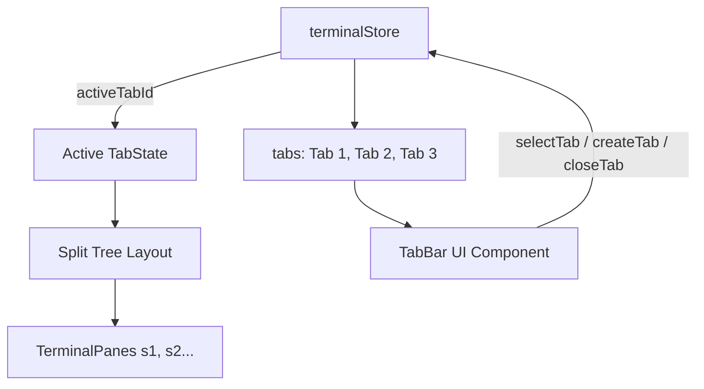

# OPPA — Terminal Tabs & Multi-Tab Workspaces Design

Date: 2026-08-17
Status: Approved

## Purpose

Upgrade OPPA (`D:\oppa\oppa`) to support multiple tabs and workspaces. Each tab functions as an independent workspace containing its own binary split-tree layout of terminal panes.

Specifically, this milestone delivers:
1. **Multi-Tab State Hierarchy**: Refactors `terminalStore.ts` to manage `tabs: TabState[]` and `activeTabId: string`, with full split-tree layout multiplexing per tab.
2. **Tab Bar UI Component (`TabBar.tsx`)**: Renders a sleek tab strip above the terminal area with active highlighting, dynamic CWD/shell title labels, inline renaming (double click), close buttons (`✕`), and a new tab button (`+`).
3. **Keyboard Shortcuts & Hotkeys**:
   - `Ctrl+T` / `Cmd+T`: Create new tab in active directory.
   - `Ctrl+W` / `Cmd+W`: Close focused pane (or close tab if last pane).
   - `Ctrl+Tab` / `Ctrl+Shift+Tab`: Cycle through tabs.
   - `Alt+1..9` / `Cmd+1..9`: Jump directly to tab 1 through 9.
4. **Cold Restore Persistence**: Serializes all tabs, layouts, and active tab index in `layout.json`, with backward compatibility for legacy single-layout saves.

---

## Architecture & Data Flow

```
src/
├── components/
│   ├── TabBar.tsx          # Tab bar strip with new tab button, tab items, close buttons
│   ├── TabBar.test.tsx      # Tab bar component unit tests
│   ├── PaneSplit.tsx       # Renders the active tab's split tree
│   └── TerminalPane.tsx    # Renders individual terminal session
└── store/
    ├── terminalStore.ts    # Multi-tab state management & actions
    └── terminalStore.test.ts # Multi-tab TDD suite
```



---

## Technical Specifications

### 1. State Model (`src/store/terminalStore.ts`)

```typescript
export interface TabState {
  id: string;
  title?: string;
  layout: Layout;
  focusedPath: Path;
}

export interface TerminalState {
  tabs: TabState[];
  activeTabId: string;
  sessions: Record<string, SessionState>;
  serializers: Record<string, () => string>;
  restoredScrollbacks: Record<string, string>;
  ready: boolean;

  // Tab Operations
  createTab: (cwd?: string) => Promise<string>;
  closeTab: (tabId?: string) => Promise<void>;
  selectTab: (tabId: string) => void;
  renameTab: (tabId: string, title: string) => void;

  // Active Tab Pane Operations
  splitPane: (dir: "h" | "v", path?: Path) => Promise<void>;
  closePane: (path?: Path) => Promise<void>;
  focusPane: (path: Path) => void;
  moveFocus: (dir: "left" | "right" | "up" | "down") => void;
  setSplitRatio: (ratio: number, path: Path) => void;

  // Persistence & Lifecycle
  saveLayout: () => Promise<void>;
  loadLayout: () => Promise<void>;
}
```

### 2. Tab Bar UI (`src/components/TabBar.tsx`)
- Container `.tab-bar` with flex row.
- Each `.tab-item`:
  - Active state class `.active` with bottom accent border.
  - Label displaying `tab.title` or active pane title (e.g. `oppa • pwsh` / folder name).
  - Double-click toggles inline `<input>` for renaming.
  - Close button `.tab-close` with hover highlight.
- New Tab Button `.tab-add` (`+`).

### 3. Keyboard Shortcuts (`src/App.tsx`):
- `Ctrl+T` / `Cmd+T`: `createTab()`.
- `Ctrl+W` / `Cmd+W`: `closePane()`.
- `Ctrl+Tab`: Next tab; `Ctrl+Shift+Tab`: Previous tab.
- `Alt+1`..`Alt+9`: Switch to tab index 0..8.

---

## Testing & Verification Plan

### Frontend Tests (`pnpm vitest run`):
1. `terminalStore.test.ts`:
   - Verify `createTab`, `closeTab`, `selectTab`, `renameTab`.
   - Verify `splitPane` and `closePane` only modify the active tab.
   - Verify `saveLayout` and `loadLayout` preserve multi-tab structures and restore scrollbacks.
2. `TabBar.test.tsx`:
   - Verify tab strip renders all tabs and marks the active tab.
   - Verify clicking tab calls `selectTab`.
   - Verify clicking `+` calls `createTab`.
   - Verify clicking `✕` calls `closeTab`.
   - Verify double-clicking enters rename mode.
3. `App.test.tsx`:
   - Verify global keybindings (`Ctrl+T`, `Ctrl+Tab`, `Alt+1..9`).

### Full Project Verification:
- `pnpm vitest run` (all tests passing).
- `pnpm build` (clean TypeScript compilation).
- `cargo check` and `cargo test -p oppa --lib`.
