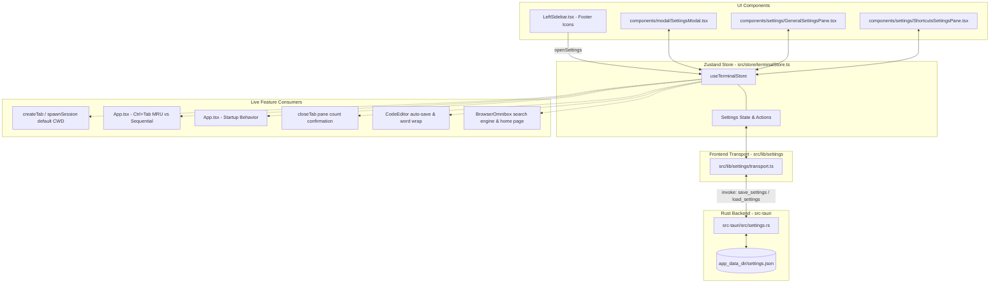

# OPPA Settings Framework & Group 1 (General Settings) Design Spec

**Date:** 2026-08-20  
**Status:** Approved  
**Topic:** Settings Architecture, UI Foundation, and Group 1 (General Settings)

---

## 1. Overview & Objectives

This specification defines the core **Settings System** for OPPA, establishing:
1. **Persistent Backend Storage**: A clean, Rust-managed `settings.json` stored in `app_data_dir()`, loaded on startup and updated via async Tauri commands.
2. **Left Sidebar UI Entry Points**: A dedicated footer in `LeftSidebar.tsx` with:
   - **Settings Button (`⚙`)**: Opens the Settings Modal on the active or default tab (<kbd>Cmd/Ctrl</kbd> + <kbd>,</kbd>).
   - **Shortcuts Button (`?`)**: Opens the Settings Modal directly on the **Shortcuts** reference cheat sheet (<kbd>Cmd/Ctrl</kbd> + <kbd>/</kbd> or <kbd>F1</kbd>).
3. **Settings Modal Foundation**: A claymorphic modal overlay containing a tabbed navigation rail (`General`, `Appearance`, `Terminal`, `Shortcuts`).
4. **Group 1 (General Settings) Live Functionality**: Complete, functional integration for all general settings — every toggle, dropdown, and text input directly controls app behavior (zero non-functional or placeholder controls).

---

## 2. Architecture & Data Flow



---

## 3. Data Schema & Types

### 3.1 TypeScript Schema (`src/lib/settings/types.ts`)

```typescript
export type DefaultCwdMode = "home" | "last_active" | "custom";
export type StartupBehavior = "restore_previous" | "workspace_launcher" | "fresh_terminal";
export type TabSwitchMode = "sequential" | "mru";
export type BrowserSearchEngine = "duckduckgo" | "google" | "bing";

export interface GeneralSettings {
  defaultCwdMode: DefaultCwdMode;
  customDefaultCwd: string;
  startupBehavior: StartupBehavior;
  tabSwitchMode: TabSwitchMode;
  confirmCloseTabWithMultiplePanes: boolean;
  confirmQuitWithRunningProcesses: boolean;
  editorWordWrap: boolean;
  editorAutoSaveDelay: number; // 0 = off, 1000 = 1s, 3000 = 3s
  browserSearchEngine: BrowserSearchEngine;
  browserHomePage: string;
}

export interface AppSettings {
  general: GeneralSettings;
  // Future setting groups (Appearance, Terminal) will plug into this top-level schema
}

export const DEFAULT_APP_SETTINGS: AppSettings = {
  general: {
    defaultCwdMode: "home",
    customDefaultCwd: "",
    startupBehavior: "restore_previous",
    tabSwitchMode: "sequential",
    confirmCloseTabWithMultiplePanes: true,
    confirmQuitWithRunningProcesses: true,
    editorWordWrap: true,
    editorAutoSaveDelay: 1000,
    browserSearchEngine: "duckduckgo",
    browserHomePage: "https://duckduckgo.com",
  },
};
```

### 3.2 Rust Schema (`src-tauri/src/settings.rs`)

```rust
use serde::{Deserialize, Serialize};
use std::path::{Path, PathBuf};
use tauri::{AppHandle, Manager};

#[derive(Debug, Clone, Serialize, Deserialize, PartialEq)]
#[serde(default)]
pub struct GeneralSettings {
    pub default_cwd_mode: String,
    pub custom_default_cwd: String,
    pub startup_behavior: String,
    pub tab_switch_mode: String,
    pub confirm_close_tab_with_multiple_panes: bool,
    pub confirm_quit_with_running_processes: bool,
    pub editor_word_wrap: bool,
    pub editor_auto_save_delay: u64,
    pub browser_search_engine: String,
    pub browser_home_page: String,
}

impl Default for GeneralSettings {
    fn default() -> Self {
        Self {
            default_cwd_mode: "home".into(),
            custom_default_cwd: String::new(),
            startup_behavior: "restore_previous".into(),
            tab_switch_mode: "sequential".into(),
            confirm_close_tab_with_multiple_panes: true,
            confirm_quit_with_running_processes: true,
            editor_word_wrap: true,
            editor_auto_save_delay: 1000,
            browser_search_engine: "duckduckgo".into(),
            browser_home_page: "https://duckduckgo.com".into(),
        }
    }
}

#[derive(Debug, Clone, Serialize, Deserialize, Default, PartialEq)]
#[serde(default)]
pub struct AppSettings {
    pub general: GeneralSettings,
}
```

---

## 4. Left Sidebar Footer Specification

In [`src/components/LeftSidebar.tsx`](file:///d:/oppa/oppa/src/components/LeftSidebar.tsx):
- Positioned permanently at the bottom of the sidebar (`.left-sidebar-footer`), above the window status bar.
- Contains two claymorphic action icon buttons with tooltips and accessible labels:
  1. **Settings Icon Button**:
     - Icon: `SettingsIcon` (from `MinimalIcons.tsx`)
     - Label / Title: `Settings (Ctrl+, / Cmd+,)`
     - Action: calls `openSettings("general")`
  2. **Shortcuts Icon Button**:
     - Icon: `HelpIcon` / `HelpCircle` (from `lucide-react` or `MinimalIcons.tsx`)
     - Label / Title: `Keyboard Shortcuts (F1 / Ctrl+/)`
     - Action: calls `openSettings("shortcuts")`
- Resizing logic: The footer stays docked at the bottom while `.left-sidebar-body` scrolls vertically if there are many workspace tabs.

---

## 5. Group 1: General Settings — Functional Behaviors

Every setting in Group 1 is directly wired to live features:

### 5.1 Default Working Directory (`defaultCwdMode`, `customDefaultCwd`)
- **Integration Points**:
  - `useTerminalStore.getState().resolveDefaultCwd()` helper function.
  - When `spawnSession(cwd)` or `createTab(cwd)` is invoked with `undefined` `cwd`:
    - `"home"`: resolves to user home directory (`os.homedir()` / standard home path or empty for PTY default).
    - `"last_active"`: resolves to `useTerminalStore.getState().getActiveCwd()` or home if none.
    - `"custom"`: resolves to `customDefaultCwd` (if valid), otherwise home.
- **UI Control**: Segmented control (`Home (~)`, `Last Active`, `Custom`) + Path input & Browse button when `Custom` is selected.

### 5.2 Startup Behavior (`startupBehavior`)
- **Integration Point**: `src/App.tsx` startup sequence.
  - `"restore_previous"` (Default): runs `loadLayout()` and reattaches to daemon sessions.
  - `"workspace_launcher"`: calls `openWorkspaceLauncher()` immediately on startup.
  - `"fresh_terminal"`: skips layout restore and creates a single clean tab with the default CWD.

### 5.3 Tab Switching Mode (`tabSwitchMode`)
- **Integration Point**: Keydown listener in `src/App.tsx` (<kbd>Ctrl+Tab</kbd> / <kbd>Ctrl+Shift+Tab</kbd>).
  - Store tracks `tabFocusHistory: string[]` (updated whenever `selectTab(tabId)` is called).
  - `"sequential"` (Default): advances tab index `(currentIndex + 1) % tabs.length`.
  - `"mru"`: switches to the most recently focused tab in history before the current one.

### 5.4 Safety Prompts (`confirmCloseTabWithMultiplePanes`, `confirmQuitWithRunningProcesses`)
- **Integration Points**:
  - `closeTab(tabId)`: Checks if the tab's layout contains more than 1 leaf node. If `confirmCloseTabWithMultiplePanes === true`, displays a lightweight confirmation dialog ("Close Tab with multiple panes?").
  - Window close listener: Checks if any session is in `"running"` status. If `confirmQuitWithRunningProcesses === true`, intercepts close to confirm.

### 5.5 Code Editor Defaults (`editorWordWrap`, `editorAutoSaveDelay`)
- **Integration Points**:
  - `src/components/editor/CodeEditor.tsx`: Passes `wordWrap: settings.general.editorWordWrap ? "on" : "off"` to Monaco options.
  - `src/store/terminalStore.ts`: `updateEditorContent(path, content)` checks `editorAutoSaveDelay`. If `> 0`, debounces a call to `saveActiveFile()`.

### 5.6 Browser Defaults (`browserSearchEngine`, `browserHomePage`)
- **Integration Points**:
  - `src/components/browser/BrowserOmnibox.tsx`: When user enters a query without `http://`, `https://`, or domain dot, formats the query using the configured search engine template:
    - DuckDuckGo: `https://duckduckgo.com/?q={query}`
    - Google: `https://www.google.com/search?q={query}`
    - Bing: `https://www.bing.com/search?q={query}`
  - `src/components/browser/BrowserViewport.tsx`: Defaults initial URL to `browserHomePage` if no URL is currently loaded.

---

## 6. Settings Modal UI Specification

- **Modal Container**:
  - Centered overlay (`.settings-modal-backdrop` and `.settings-modal-card`).
  - Dimensions: `720px` max width, `520px` height.
  - Keyboard: <kbd>Esc</kbd> closes modal.
- **Left Navigation Rail**:
  - Tabs:
    - ⚙️ **General** (Active in Group 1)
    - 🎨 **Appearance** (Disabled/Coming next)
    - 💻 **Terminal** (Disabled/Coming next)
    - ⌨️ **Shortcuts** (Active — searchable cheatsheet)
- **General Settings Pane**:
  - Divided into clean, readable cards/sections with subheaders:
    - **Workspace & Startup**: Default CWD, Startup Behavior
    - **Navigation & Tabs**: Tab Switch Mode
    - **Confirmations & Safety**: Close Tab with multiple panes prompt, Quit with running processes prompt
    - **Code Editor**: Word Wrap, Auto-Save Delay
    - **Web Browser**: Search Engine, Home Page
- **Shortcuts Cheatsheet Pane**:
  - Displays categorised hotkey cards for Tabs, Panes, Sidebars, App Modes, and Launcher.

---

## 7. Testing Strategy

1. **Rust Backend Tests (`src-tauri/src/settings.rs`)**:
   - `save_settings_at` and `load_settings_at` roundtrip serialization test.
   - Default fallback test when `settings.json` does not exist or has partial fields.
2. **Frontend Transport & Store Tests (`src/store/terminalStore.test.ts`)**:
   - Store initializes with default settings.
   - `updateSettings` updates state and triggers transport save.
   - `resolveDefaultCwd` resolves home, last_active, and custom paths correctly.
   - `tabSwitchMode` MRU vs sequential tab ordering.
   - Multi-pane tab close confirmation triggers when enabled.
3. **UI Component Tests**:
   - `LeftSidebar.test.tsx`: Tests that footer settings and shortcuts buttons render and trigger `openSettings`.
   - `SettingsModal.test.tsx`: Tests tab navigation, control changes, and modal dismissal.
